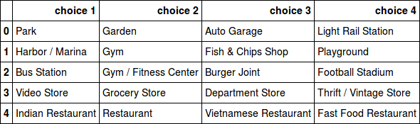
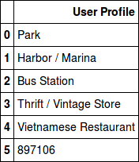
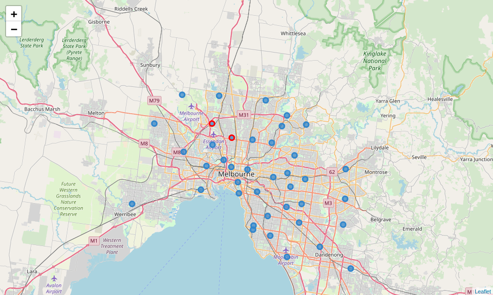

# Introduction

When people come to a new city, there are a lot a of obstacles and difficulties in their
ways. One of the main difficulty is to find a suitable neighborhood. Each neighborhood is
suitable for some groups of people according to their preferences and their income. In this
project I suggest a neighborhood to a user by asking them five multiple choice questions
and how much they can afford to pay for housing. I chose Melbourne, the capital and
most populous city of the Australian state of Victoria, and the second-most populous city
in Australia and Oceania, for my project. So this project help people who are looking
for house in Melbourne find the right neighborhood.

# Data

I use two main source of data for my project.

- Foursquare location data: Foursquare is a local search-and-discovery service. it
    features a developer API that lets third-party applications make use of Foursquare’s
    location data. I use this API to search and find out about different venues and their
    categories of each neighborhood.
- Melbourne Housing Snapshot[1]: I use this data set to understand the price of
    houses in Melbourne. this data set contains a lot of features but I just use price(to
    normalize price) and location of the house.

# Methodology

I use content-based recommendation system in this project. Users answer to five question
about their preferences, and their profile will form according to their answers. Each
question asks user ”Which kind of place do you prefer to go?” and user can choose
between four different options. For example her choices are:’Chinese Restaurant’,’Indian
Restaurant’,’Falafel Restaurant’, and ’Korean Restaurant’. Also I ask user about how
much money they can afford for housing. I had no other option than content-based
recommendation system, because our system does not have other users information, so
collaborative filtering recommendation system is not feasible. In final step after using
user’s profile and the matrix of the neighborhood to rank every neighborhood according
to user’s profile, I choose a neighborhood with highest rank between neighborhood that
user can afford.
One important note is if we want to know our users as best as possible with five
questions, it’s important to ask user good questions. I try to reach that goal by using two
well known feature selection techniques: low variance filter and high correlation filter.
Low variance filter logic is features with low variance are less informative. I choose 60
category with highest variance at first step. High correlation between two variables means
they have similar trends and are likely to carry similar information. So for each question
if choices have low correlation with each other our question is more meaningful. I choose
threshold of low correlation equal to 0.6.

# Result

I show my result with an example. Figure 1 represent an example of five question that
we choose to ask user. Figure 2 shows a user profile according to her answers to above
questions. Finally figure 3 shows perfect neighborhood for this user with red marker on
the map of Melbourne.  

 
 
 
 

# Discussion

Some neighborhood are more preferable by many users. They have variety of venue and
price is reasonable. This project can be improved by engaging more features like rent
price, distance from point that user can choose, rate of crime,etc.

# Conclusion

We can use location data of venues and average housing price of a neighborhood to find
a perfect neighborhood for any user.

# References

[1] https://www.kaggle.com/dansbecker/melbourne-housing-snapshot

